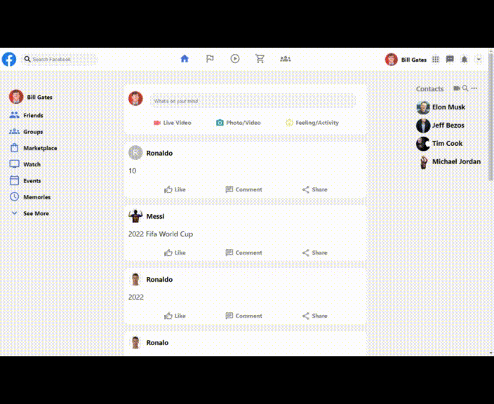

# Facebook Clone

This project was bootstrapped with [Create React App](https://github.com/facebook/create-react-app), using the [Redux](https://redux.js.org/), [Redux Toolkit](https://redux-toolkit.js.org/) template and [Firebase](https://firebase.google.com/).



-   Post Functionality
-   Responsive Design

## Features and Fuctionality

-   Login using Email/Password (Firebase Authentication)
-   Create a new post
-   Realtime posts update
-   Auto authenticate user on refresh
-   Sign Out/Sign In

## How to build your own..?

1. Clone this repo
1. Install all the dependencies
    ```bash
    npm i
    ```
1. Setup Firebase

    - Create Firebase account
    - Create a new project
    - Create a web app for that
    - Copy your config from there

        - Select config option
        - Paste those config inside src/firebase.js file

    - Setup authentication email/password authentication using Firebase

1. Let's build the optimized version

    ```bash
    npm run build
    ```

1. **Now for hosting on Firebase lets config Firebase locally**

    - Install Firebase CLI
    - Login to Firebase

        ```bash
        firebase login
        ```

    - Initialize Firebase

        ```bash
        firebase init
        ```

    - Select hosting in the menu
    - Select your respective project from the list
    - Select 'build' as your hosting directory and other options as you want
    - Let's deploy our clone and make it live

        ```bash
        firebase deploy
        ```

**That's it our clone is up and running share it now**

## Future Plans

-   Might add more login methods
-   Post deleting functionality
-   Add comments and likes on post

**_NOTE: PLEASE LET ME KNOW IF YOU DISCOVERED ANY BUG OR YOU HAVE ANY SUGGESTIONS_**

## Available Scripts

In the project directory, you can run:

### `npm start`

Runs the app in the development mode.\
Open [http://localhost:3000](http://localhost:3000) to view it in your browser.

The page will reload when you make changes.\
You may also see any lint errors in the console.

### `npm test`

Launches the test runner in the interactive watch mode.\
See the section about [running tests](https://facebook.github.io/create-react-app/docs/running-tests) for more information.

### `npm run build`

Builds the app for production to the `build` folder.\
It correctly bundles React in production mode and optimizes the build for the best performance.

The build is minified and the filenames include the hashes.\
Your app is ready to be deployed!

See the section about [deployment](https://facebook.github.io/create-react-app/docs/deployment) for more information.

### `npm run eject`

**Note: this is a one-way operation. Once you `eject`, you can't go back!**

If you aren't satisfied with the build tool and configuration choices, you can `eject` at any time. This command will remove the single build dependency from your project.

Instead, it will copy all the configuration files and the transitive dependencies (webpack, Babel, ESLint, etc) right into your project so you have full control over them. All of the commands except `eject` will still work, but they will point to the copied scripts so you can tweak them. At this point you're on your own.

You don't have to ever use `eject`. The curated feature set is suitable for small and middle deployments, and you shouldn't feel obligated to use this feature. However we understand that this tool wouldn't be useful if you couldn't customize it when you are ready for it.

## Learn More

You can learn more in the [Create React App documentation](https://facebook.github.io/create-react-app/docs/getting-started).

To learn React, check out the [React documentation](https://reactjs.org/).
